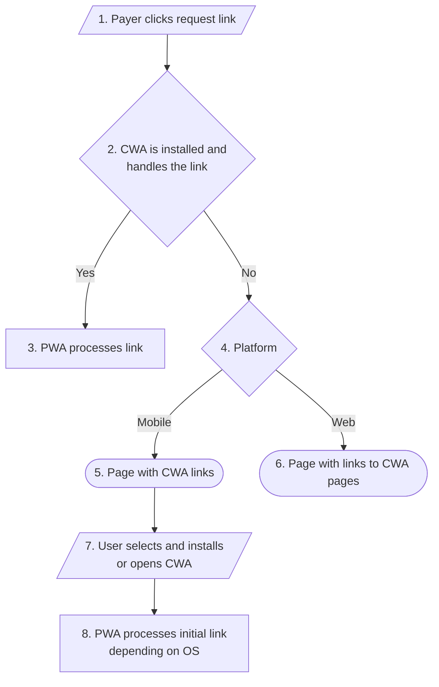

# CryptoPlease Universal Links

Backend code for the CryptoPlease Universal Links protocol support.

## Keywords and definitions

1. Universal Links Manager (ULM) – a platform that manages the list of compatible apps and provides valid `assetlinks.json` and `apple-app-site-association` files for all the registered participants.
2. Compatible Wallet App (CWA) – any Wallet app that is registered in ULM and supports universal links format described in this document.
3. Requester Wallet App (RWA) – CWA that was used to generate the universal link.
4. Payer Wallet App (PWA) – CWA that is used to process the universal link.

## Motivation

Currently, Solana Pay protocol defines only custom scheme link. It leads to some limitations:

- Payer should already have a compatible wallet app installed. While this can be ok for the use case of merchants awaiting the payment here and now, it doesn't cover a broader use case of requesting the payment (asynchronously) via the payment link. If Alice wants to request payment from Bob and sends him the payment link (and Bob doesn't have a compatible app installed), there's no easy way for Bob to process this link – he needs to:
  1. find the compatible app;
  2. install it;
  3. return to the messages;
  4. click on the link again.
- Custom schemes have pretty bad support in messaging apps (e.g. Telegram and Whatsapp recognize only a very small subset of custom schemes). In that case, the link is not clickable at all, and the user has no easy way to pass it to the wallet. QR codes don't solve all the use cases since sending QR codes in a messaging app means that the user has to use 1 device for displaying the QR code and another device for scanning it.

Universal links are designed to solve this problem since they allow displaying of a landing page (if user doesn't have a compatible app installed) with instructions and/or seamless onboarding flow.

## Registration

1. Wallet applies for registration at ULM and provides the following information:

   | Parameter      | Required           | Description                                   |
   | -------------- | ------------------ | --------------------------------------------- |
   | Name           | :white_check_mark: | Name of the app, e.g. "Crypto Please"         |
   | URL            | :white_check_mark: | Landing page, e.g. "https://cryptoplease.com" |
   | Android ID     | :x:                | E.g. "com.pleasecrypto.flutter"               |
   | Android Sha256 | :x:                |                                               |
   | AppStore ID    | :x:                | E.g. "1559625715"                             |
   | iOS Bundle ID  | :x:                | E.g. "com.pleasecrypto.flutter"               |
   | iOS Team ID    | :x:                | E.g. "US38KFXH3P"                             |

2. ULM registers the Wallet app and assigns `appId`, e.g. `cryptoplease`.
3. ULM adds Wallet data to `assetlinks.json` and `apple-app-site-association` so that Wallet can integrate universal links support.

## Link generation

1. RWA generates the Solana Pay link in the following format:

   ```
   https://solanapay.cryptoplease.link/mvines9iiHiQTysrwkJjGf2gb9Ex9jXJX8ns3qwf2kN?amount=1&label=Michael&message=Thanks%20for%20all%20the%20fish&memo=OrderId1234&appId=cryptoplease
   ```

   It follows [Solana Pay](https://docs.solanapay.com/spec) specification except for:

   - scheme (`https` instead of `solana`);
   - host (`solanapay.cryptoplease.link` instead of no host);
   - `appId` parameter assigned to the Wallet app by ULM.

2. User sends the link to the payer using any method.

## Link processing



1. Payer clicks the request link.
2. OS checks whether the CWA is installed and should process the link. There's no guarantee that the app will be used for link processing even if it's installed: that's what OS decides based on many parameters.

   PWA can be the same as RWA or any different CWA.

3. If PWA is selected for link processing, it should process the link.
4. If no CWA is installed or it wasn't selected by OS to process the link, OS opens the link in the browser. This page contains the following info, depending on the platform.
5. If opened on mobile:

   - information about the requested payment (amount, recipient, etc.);
   - link to install/open default CWA;
   - links to install other CWA.

   Default CWA is selected according to the following algorithm:

   - if `appId` is passed to the link and the app is available for the corresponding platform (Android or iOS), it's selected as the default CWA.
   - random app from all the apps that is available for the corresponding platform.

   Other CWAs are selected from all the apps that are available for the corresponding platform.

6. If opened on the web:

- information about the requested payment (amount, recipient, etc.);
- links to the app pages.

11. User selects and installs CWA. The app gets the initial link depending on the platform:

- iOS: link is copied to the clipboard. After installation, the app should check the clipboard and process the link if it's available;
- Android: link is passed as the referrer parameter to Google Play. After installation, the app can check this parameter using `com.android.vending.INSTALL_REFERRER` intent filter.

These are the same methods as used e.g. by Firebase Dynamic Links.

12. PWA processes the initial link if it's available.

## Potential issues

According to the [documentation](https://developer.apple.com/library/archive/documentation/General/Conceptual/AppSearch/UniversalLinks.html), the uncompressed size of the `apple-app-site-association` file must be no greater than 128 KB.

There's no official limit for `assetlinks.json` file, but for a very large file timeout error [can happen](https://stackoverflow.com/a/71016796/1037345).

## Advantages

1. Standardization. Even if RWA and PWA are different apps they can still be used seamlessly to process payment links.
2. Promotion. If Payer doesn't have CWA installed, the promoted app will be the one that was used to generate the link. All other compatible wallets are listed and promoted as well.
