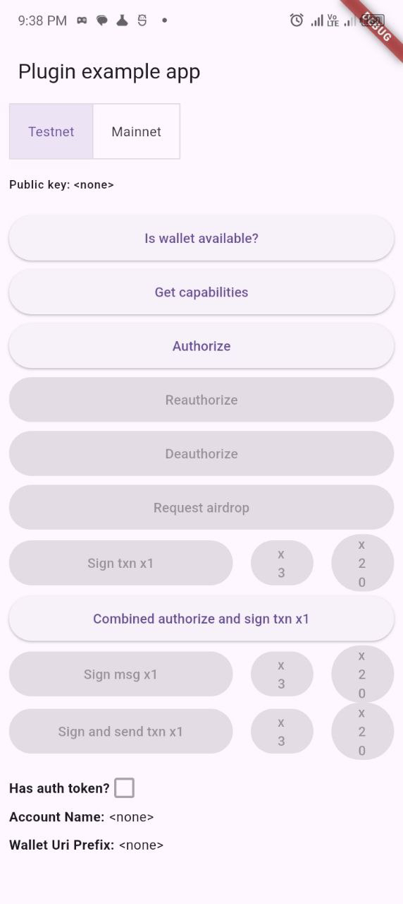
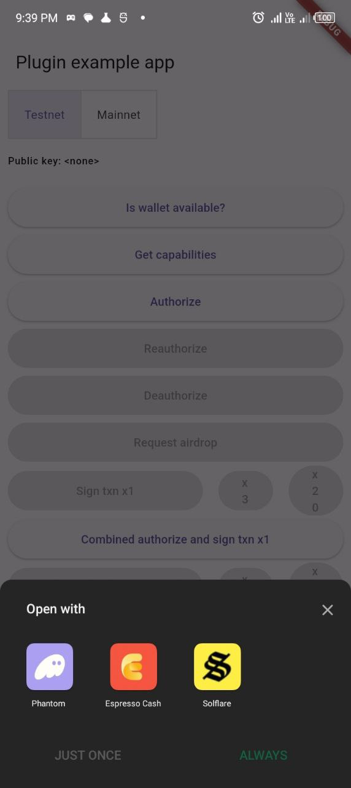

# solana_mobile_client

A Flutter plugin for integrating Solana Mobile features into your Flutter apps.

## Features

- Authorize and sign transactions with Solana Mobile Wallet Adapter
- Request airdrops and check wallet availability
- Support for Android (iOS has issues with MWA standards)
- Easy integration with your existing Flutter app

## Screenshots

<p align="center">
  
  
</p>

<p align="center">
  <em>Left: Home screen &nbsp;&nbsp;&nbsp; | &nbsp;&nbsp;&nbsp; Right: Wallet connect modal</em>
</p>

## Platform Support

- [x] Android

## Getting Started

Add this to your `pubspec.yaml`:

```yaml
dependencies:
  solana_mobile_client: ^<latest_version>
```

## Usage

To use this package, follow these steps:

### 1. Create a Solana Client

You can switch between testnet and mainnet by changing the URLs and cluster string.

```dart
import 'package:solana/solana.dart';

// Create a SolanaClient instance globally or in your State class
late SolanaClient solanaClient;

void setupSolanaClient({bool isMainnet = false}) {
  solanaClient = SolanaClient(
    rpcUrl: Uri.parse(isMainnet
        ? 'https://api.mainnet-beta.solana.com'
        : 'https://api.testnet.solana.com'),
    websocketUrl: Uri.parse(isMainnet
        ? 'wss://api.mainnet-beta.solana.com'
        : 'wss://api.testnet.solana.com'),
  );
}
```

---

### 2. Authorize (Connect) Wallet

```dart
import 'package:solana_mobile_client/solana_mobile_client.dart';

String? authToken;
Uint8List? publicKey;

Future<void> authorizeWallet() async {
  final session = await LocalAssociationScenario.create();
  await session.startActivityForResult(null);

  final client = await session.start();
  final result = await client.authorize(
    identityUri: Uri.parse('https://yourdapp.com'),
    iconUri: Uri.parse('favicon.ico'),
    identityName: 'Your Dapp Name',
    cluster: 'testnet', // or 'mainnet-beta'
  );
  if (result != null) {
    authToken = result.authToken;
    publicKey = result.publicKey;
    // Save these in your state
  }
  await session.close();
}
```

---

### 3. Deauthorize (Disconnect) Wallet

```dart
Future<void> deauthorizeWallet() async {
  if (authToken == null) return;
  final session = await LocalAssociationScenario.create();
  await session.startActivityForResult(null);

  final client = await session.start();
  await client.deauthorize(authToken: authToken!);
  authToken = null;
  publicKey = null;
  await session.close();
}
```

---

### 4. Request Airdrop

```dart
Future<void> requestAirdrop() async {
  if (publicKey == null) return;
  await solanaClient.requestAirdrop(
    address: Ed25519HDPublicKey(publicKey!),
    lamports: 1000000000, // 1 SOL = 1,000,000,000 lamports
  );
}
```

---

### 5. All above usage examples in one class

```dart
import 'package:flutter/material.dart';
import 'package:solana/solana.dart';
import 'package:solana_mobile_client/solana_mobile_client.dart';

class SolanaMobileDemo extends StatefulWidget {
  const SolanaMobileDemo({super.key});

  @override
  State<SolanaMobileDemo> createState() => _SolanaMobileDemoState();
}

class _SolanaMobileDemoState extends State<SolanaMobileDemo> {
  late SolanaClient solanaClient;
  String cluster = 'testnet'; // or 'mainnet-beta'
  String? authToken;
  Uint8List? publicKey;

  @override
  void initState() {
    super.initState();
    setupSolanaClient();
  }

  void setupSolanaClient() {
    solanaClient = SolanaClient(
      rpcUrl: Uri.parse(cluster == 'mainnet-beta'
          ? 'https://api.mainnet-beta.solana.com'
          : 'https://api.testnet.solana.com'),
      websocketUrl: Uri.parse(cluster == 'mainnet-beta'
          ? 'wss://api.mainnet-beta.solana.com'
          : 'wss://api.testnet.solana.com'),
    );
  }

  Future<void> authorizeWallet() async {
    final session = await LocalAssociationScenario.create();
    await session.startActivityForResult(null);

    final client = await session.start();
    final result = await client.authorize(
      identityUri: Uri.parse('https://yourdapp.com'),
      iconUri: Uri.parse('favicon.ico'),
      identityName: 'Your Dapp Name',
      cluster: cluster,
    );
    if (result != null) {
      setState(() {
        authToken = result.authToken;
        publicKey = result.publicKey;
      });
    }
    await session.close();
  }

  Future<void> deauthorizeWallet() async {
    if (authToken == null) return;
    final session = await LocalAssociationScenario.create();
    await session.startActivityForResult(null);

    final client = await session.start();
    await client.deauthorize(authToken: authToken!);
    setState(() {
      authToken = null;
      publicKey = null;
    });
    await session.close();
  }

  Future<void> requestAirdrop() async {
    if (publicKey == null) return;
    await solanaClient.requestAirdrop(
      address: Ed25519HDPublicKey(publicKey!),
      lamports: 1000000000,
    );
    ScaffoldMessenger.of(context).showSnackBar(
      const SnackBar(content: Text('Airdrop requested')),
    );
  }

  @override
  Widget build(BuildContext context) {
    return Scaffold(
      appBar: AppBar(title: const Text('Solana Mobile Demo')),
      body: Padding(
        padding: const EdgeInsets.all(16),
        child: Column(
          crossAxisAlignment: CrossAxisAlignment.start,
          children: [
            Text('Address: \\${publicKey != null ? Ed25519HDPublicKey(publicKey!).toBase58() : "Not connected"}'),
            const SizedBox(height: 16),
            ElevatedButton(
              onPressed: authorizeWallet,
              child: const Text('Authorize Wallet'),
            ),
            ElevatedButton(
              onPressed: authToken != null ? deauthorizeWallet : null,
              child: const Text('Deauthorize'),
            ),
            ElevatedButton(
              onPressed: publicKey != null ? requestAirdrop : null,
              child: const Text('Request Airdrop'),
            ),
            const SizedBox(height: 16),
            Row(
              children: [
                ElevatedButton(
                  onPressed: () {
                    setState(() {
                      cluster = 'testnet';
                      setupSolanaClient();
                    });
                  },
                  child: const Text('Testnet'),
                ),
                const SizedBox(width: 8),
                ElevatedButton(
                  onPressed: () {
                    setState(() {
                      cluster = 'mainnet-beta';
                      setupSolanaClient();
                    });
                  },
                  child: const Text('Mainnet'),
                ),
              ],
            ),
          ],
        ),
      ),
    );
  }
}
```

---

**Notes:**

- `authToken` and `publicKey` should be stored in your widget state.
- Always close the session after each operation.
- You can use the `cluster` variable to switch between testnet and mainnet.
- For more advanced usage (signing transactions/messages), see the [example](example/) directory.

---

## Contributing

Contributions are welcome! Please open issues and pull requests.

For more information, see the [Solana Mobile Stack documentation](https://docs.solanamobile.com/).
